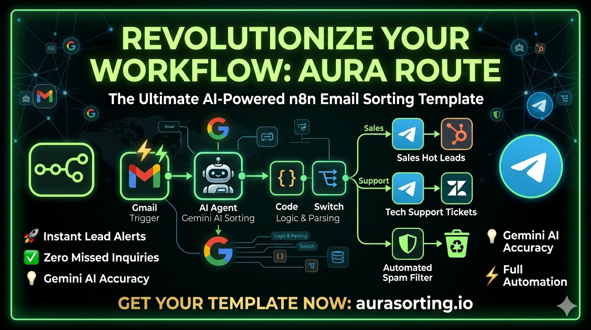

# ✉️ AI-Driven Email Orchestration

### 🛠 Architecture Preview

Automate your email triage and routing with Gemini AI. Instantly process leads, support tickets, and filter spam 24/7.

## 🏗 Architecture Workflow

The system consists of three main blocks:
1. **Trigger:** Listens for new incoming messages using the Gmail Trigger.
2. **AI Agent + Model:** Uses **Google Gemini** to analyze text, categorize the intent, and output a structured JSON object.
3. **Switch & Actions:** Evaluates the result and routes your message to the correct channel (Slack, Telegram, or CRM).

---

## 🚀 Features

- **🤖 Smart AI Classification:** Instantly categorizes messages into `sales`, `support`, `partnership`, or `spam`.
- **⚡ Instant Alerts:** Forwards notifications and text snippets directly to your messenger.
- **🛡 Automated Spam Filtering:** Removes unnecessary newsletters and `noreply` notifications from your workspace.
- **⚙️ Full Automation Engine:** Works silently in the background 24/7 using your self-hosted or cloud n8n instance.

---

### 🛒 Get Full Access
Transform your content operations into a fully autonomous engine.

[**👉 Get DeepPublish AI on Gumroad**](https://naroka.gumroad.com/l/leuao)

---

## 🛠 Prerequisites and Requirements

To run this workflow, you need:
* **n8n** version 1.0 or higher (self-hosted or n8n Cloud).
* **Google Cloud / AI Studio** credentials to access the Gemini model.
* **Gmail** credentials (configured with access scopes).
* **Telegram Bot Token** (for notifications).

---

## 📥 Installation and Setup Instructions

1. **Clone or download** the `ai-routing.json` workflow file.
2. Open your n8n dashboard and **import** the workflow.
3. Open the **Gmail Trigger** node and connect your email account.
4. Open the **Google Gemini Chat Model** node and add your personal API Key.
5. Set up your Telegram channel or group chat IDs in the `Telegram (Sales)` and `Telegram (Support)` notification nodes.
6. Click **Activate** in the top right corner to run the service autonomously.

---
### Get in touch:

* 💬 **Telegram:** [t.me/nar00ka](https://t.me/nar00ka) — let’s discuss your idea in 10 minutes.
* 🐙 **GitHub:** https://github.com/nar0ka — explore my open-source projects.
* 📦 **Gumroad:** https://naroka.gumroad.com — check out ready-to-use workflows.
* [**WhatsApp:** https://wa.me/380632991898](https://wa.me/380632991898)

> **💡 Bonus:** If you are not sure where to start your automation journey, just drop me a message — I will help you identify which processes can be optimized today!

---

### License
This project is licensed under the MIT License.
